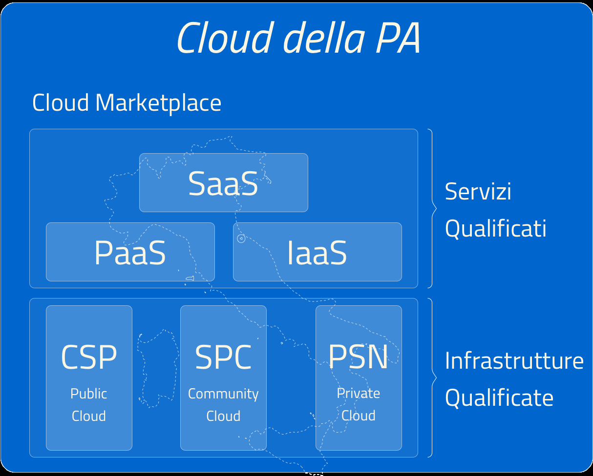

Titolo divertente 
==================

Testo super tecnico di introduzione al documento. Formazione a Docs
Italia in AgID con la g grande. Questo è un elenco numerato:

1. voce di elenco;

2. voce di elenco;

3. voce di elenco.

Punto elenco simpatico:

-  ciao;

-  arrivederci;

-  addio.

|image0|

**Figura 1. Didascalia dell’immagine**

+-----------------------------------+-----------------------------------+
| Nome                              | Standardizzazione moduli SUAP e   |
|                                   | SUE                               |
+===================================+===================================+
| Tempi                             | In corso                          |
+-----------------------------------+-----------------------------------+
| Attori                            | Dipartimento per la Funzione      |
|                                   | Pubblica, AgID, Regioni, PAL,     |
|                                   | Unioncamere                       |
+-----------------------------------+-----------------------------------+
| Descrizione                       | Definizione formale attraverso    |
|                                   | l’utilizzo del linguaggio di      |
|                                   | descrizione XML-Schema condiviso  |
|                                   | a livello nazionale.              |
+-----------------------------------+-----------------------------------+
| Risultato atteso                  |                                   |
+-----------------------------------+-----------------------------------+

+-----------------------------------+-----------------------------------+
| Nome                              | Definizione delle “interfacce di  |
|                                   | servizio” delle macro-componenti  |
|                                   | dei sistemi SUAP e SUE            |
+===================================+===================================+
| Tempi                             | In corso                          |
+-----------------------------------+-----------------------------------+
| Attori                            | Dipartimento per la Funzione      |
|                                   | Pubblica, AgID, Regioni, PAL,     |
|                                   | Unioncamere                       |
+-----------------------------------+-----------------------------------+
| Descrizione                       | Al fine di definire le            |
|                                   | “interfacce di servizio” delle    |
|                                   | macro-componenti dei sistemi SUAP |
|                                   | e SUE necessari a garantire       |
|                                   | l’interoperabilità dei sistemi si |
|                                   | provvederà ad:                    |
|                                   |                                   |
|                                   | -  individuare dei processi tipo  |
|                                   |       che implementano i          |
|                                   |       procedimenti amministrativi |
|                                   |                                   |
|                                   | -  individuare le                 |
|                                   |       macro-componenti            |
|                                   |       architetturali              |
+-----------------------------------+-----------------------------------+
| Risultato atteso                  |                                   |
+-----------------------------------+-----------------------------------+

